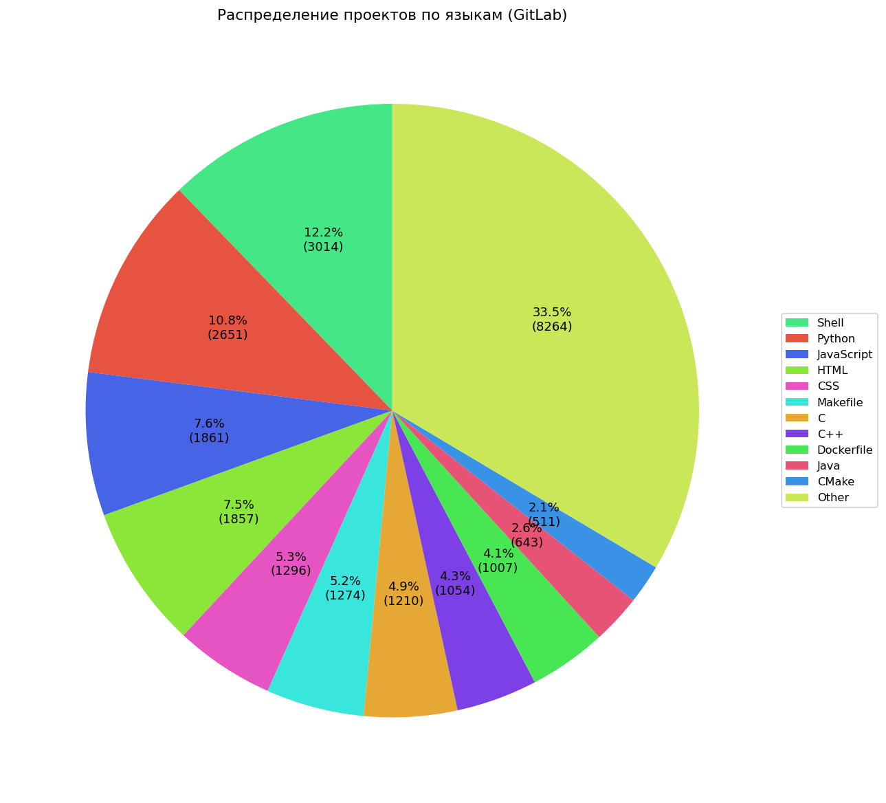
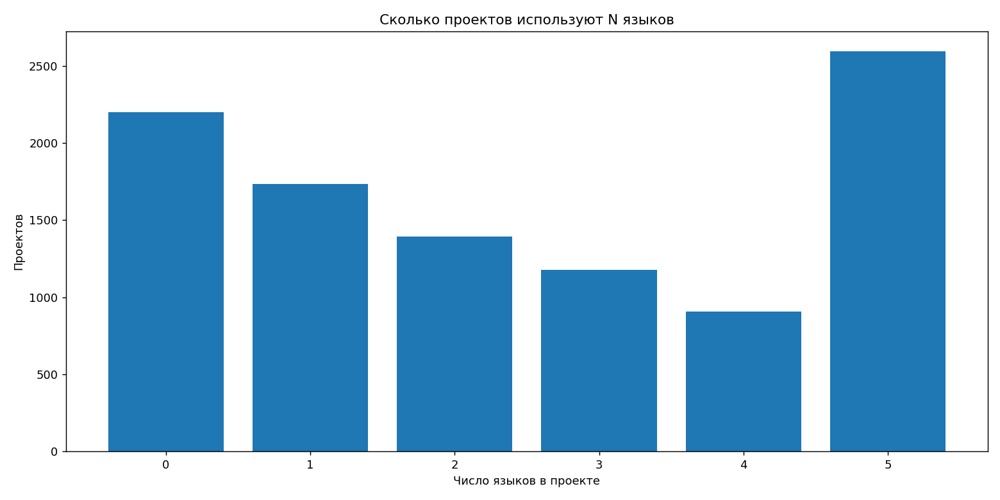

# Gitlab language analysis

## Тема: "Анализ использования языков программирования на GitLab"

## Задачи:
1. Распределение языков по количеству проектов - Сколько проектов используют определённый язык?
2. Кластеризация проектов по использованным языкам - Разные языки используются для разных целей. Значит, по языкам проекты можно кластеризировать по типам, например: "веб-приложения", "мобильная разработка" и т. д.
3. Прогноз популярности языков - Как изменится популярность языков в ближайшем будущем?
4. Сколько проектов используют определённое количество языков? - Сколько тех, что используют лишь один язык? А два? А три?  т. д.
5. Как соотносятся размеры репозиториев и их языки? - На чем пишут большие проекты, а на чём небольшие?

## Команда:
- Семичев Александр Сергеевич, гр. 5140904/50202, @alex-chemis
- Нефедев Виктор Константинович, гр. 5140904/50202, @Koteron
- Истаев Эрдэм Эрдэниевич, гр. 5140904/50101, @Isterd
- Ефимов Максим Андреевич, гр. 5140904/50201, @Grayaga1n

## Первичный анализ

- Формат датасета: https://github.com/alex-chemis/gitlab-analysis/tree/main/data
- Cкрипты: https://github.com/alex-chemis/gitlab-analysis/tree/main/src/scripts
- Артефакты: https://github.com/alex-chemis/gitlab-analysis/tree/main/outputs


## Выполненные задачи

1. Распределение языков по количеству проектов<br /><br />
Сколько проектов используют определённый язык?<br /><br />
<br /><br />
Диаграмма показывает распределение проектов на GitLab по используемым языкам программирования. Наибольшая доля принадлежит JavaScript - почти четверть всех проектов (23,9%), что отражает популярность этого языка для веб-разработки и фронтенда. Следом идут HTML, Python, Shell и CSS, каждый из которых занимает около 9-10% - эти языки часто используются совместно в веб-и DevOps-сфере.<br /><br />
Менее значительные доли занимают Dockerfile, Makefile, Java, C, C++, TypeScript, PHP, C# и другие - их доля колеблется от 1% до 4%. Это говорит о большом разнообразии экосистемы GitLab, где присутствуют как традиционные системные языки, так и современные инструменты автоматизации и конфигурации.<br /><br />

2. Кластеризация проектов по использованным языкам<br /><br /> 
Разные языки используются для разных целей. Значит, по языкам проекты можно кластеризировать по типам, например: "веб-приложения", "мобильная разработка" и т. д.<br /><br />

3. Прогноз популярности языков <br /><br />
Как изменится популярность языков в ближайшем будущем? <br /><br />

4. Сколько проектов используют определённое количество языков?<br /><br />
Найти, что сколько тех, что используют лишь один язык? А два? А три? и т. д.<br /><br />
<br /><br />
Gitlab позволяет выгружать максимум 5 языков, использующиеся больше всего, игнорируя остальные. Поэтому отобразить возможно лишь статистику от 1 до 5+ языков. Однако, этого уже достаточно для проведения некоторого анализа этой статистики.<br /><br />
Как видно из графика, большая часть проектов на Gitlab (>1 млн. при общей выборке ~4.1 млн.) используют лишь один язык программирования. Меньше всего используют 4 языка (~400 тысяч), а 2 и 5+ примерно одинаковое количество проектов (~650 тысяч)<br /><br />

5. Как соотносятся размеры репозиториев и их языки?<br /><br />
На чем пишут большие проекты, а на чём небольшие?<br />


## Запуск

#### 1) Нужно изменить `.env.example` → `.env` и задать `GITLAB_TOKEN`.
   Токен повышает лимиты API (персональный токен GitLab).

#### 2) Собрать проект:
```bash
docker compose up -d --build
```

#### 3) Далее можно использовать следующие команды:
```bash
# Для сбора данных
docker compose run --rm app python -m app fetch

# Для построения гистограммы топ 20 языков
docker compose run --rm app python -m scripts.lang_distribution_chart --top 20 --out /app/outputs/lang_top20.png

# Для построения графика медианных форков по языкам
docker compose run --rm app python -m scripts.median_forks_by_language \
		--top-langs 20 --top 20 --min-projects 10 --out /app/outputs/median_forks_by_language.png

# Для построения графика медианных звёзд по языкам
docker compose run --rm app python -m scripts.median_stars_by_language \
		--top-langs 20 --top 20 --min-projects 10 --out /app/outputs/median_stars_by_language.png

# Для построения круговой диаграммы распределния проектов по языкам
docker compose run --rm app python -m scripts.lang_pie_chart --top 12 --out /app/outputs/lang_pie.png

# Для построения гистограммы количества языков по проектам
docker compose run --rm app python -m scripts.languages_per_project_hist --out /app/outputs/languages_per_project.png
```

#### 4) Результаты 

После выполнения вышеперечисленных команд система будет создавать графики в папке outputs

В данном репозитории приведены данные графики после обработки 10 000 данных проектов

